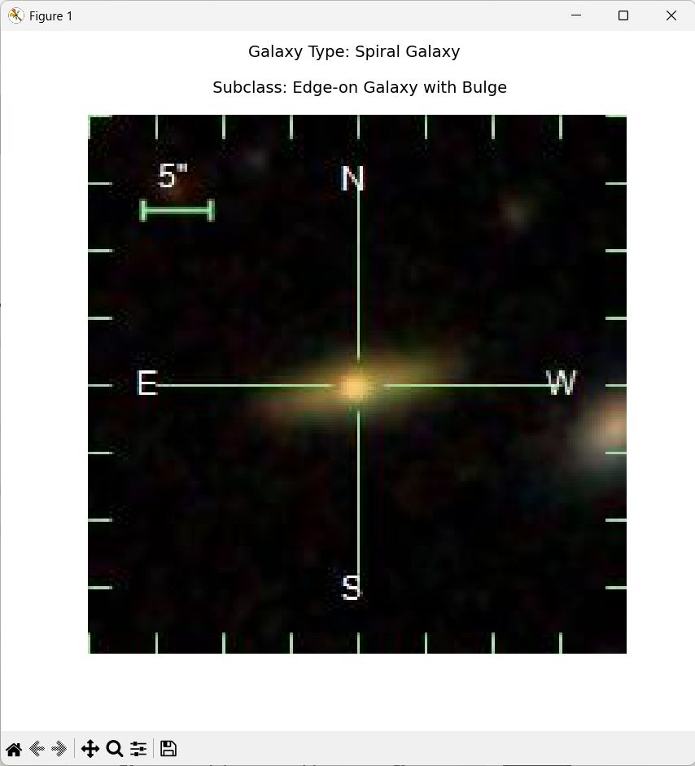

This repository contains a machine learning model for classifying galaxy morphologies based on astronomical image data. The model is trained to distinguish between different types of galaxies, such as spiral, elliptical, and irregular galaxies, with further subclassification where applicable.

## Features
- **Deep Learning Model**: Uses convolutional neural networks (CNNs) for high-accuracy classification.
- **Automated Preprocessing**: Includes data augmentation and normalization.
- **Multi-Class Classification**: Identifies different galaxy morphologies and their subcategories.
- **Visualization Tools**: Generates annotated images with classification results.

## Sample Test Output
Below is an example of the model's classification output:



### Classification Result:
- **Galaxy Type**: Spiral Galaxy
- **Subclass**: Edge-on Galaxy with Bulge

## Installation
To set up the model on your local machine, follow these steps:
```bash
# Clone the repository
git clone https://github.com/jsdingra/ML-for-Galaxy-Morphology-Classification.git
cd galaxy-morphology-classification

# Install dependencies
pip install -r requirements.txt
```
Complete code and model is not provide but can be asked on demand.
<br>
~ Vikramjeet Singh <br>
~ Jashanpreet Singh Dingra

astrodingra@gmail.com
